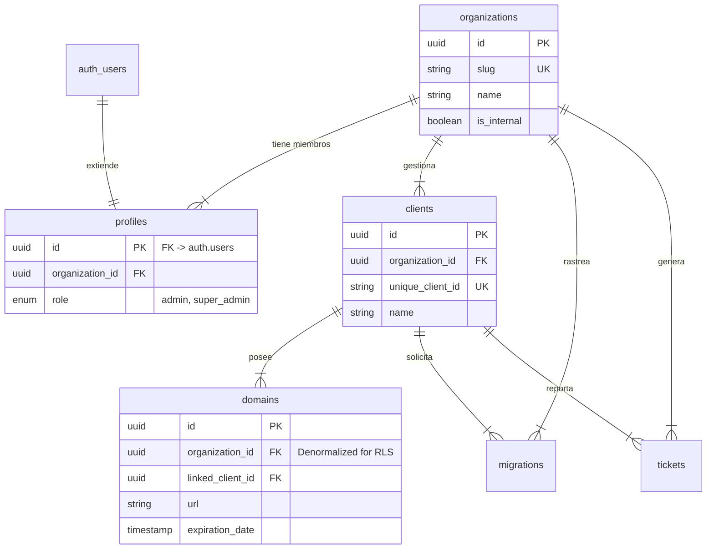

# Blueprint de Arquitectura de Datos - Janus Monitor (Core)

> **Estado:** Borrador (Draft)
> **Fecha:** 20 de Enero, 2026
> **Autor:** Antigravity (AI Data Architect)

Este documento detalla el diseño de la base de datos PostgreSQL en Supabase, centrándose en la seguridad Multi-tenant, integridad de datos y escalabilidad para la plataforma Janus Monitor.

## 1. Visión General de Arquitectura

El sistema utiliza un modelo de **Tenancy Discriminator** (Discriminador de Inquilino) a nivel de fila. Cada tabla sensible contiene una columna `organization_id` que segrega lógicamente los datos.

### Roles y Jerarquía

1.  **Super Admin**: Usuario interno de "Arknica" (Platform Owner). Tiene acceso transversal a todas las organizaciones (God Mode).
2.  **Org Admin**: Cliente final (ej. "Rueda la Rola"). Solo puede acceder a filas donde `organization_id` coincide con su asignación.

---

## 2. Diagrama Entidad-Relación (ERD)



---

## 3. Definición de Esquema (Schema Definition)

### Convenciones

- **Primary Keys**: UUID v4 (`gen_random_uuid()`).
- **Timestamps**: `created_at` (default `now()`), `updated_at`.
- **Nomenclatura**: `snake_case`.

### 3.1 Tablas Core

#### `organizations`

La entidad raíz para el multi-tenancy.
| Columna | Tipo | Restricciones | Descripción |
| :--- | :--- | :--- | :--- |
| `id` | UUID | PK, Default: `gen_random_uuid()` | ID único de la organización. |
| `name` | TEXT | NOT NULL | Nombre legible (ej. "Rueda la Rola"). |
| `slug` | TEXT | UNIQUE, NOT NULL | Identificador para URL (ej. `rueda-la-rola`). |
| `logo_url` | TEXT | NULLABLE | URL del logo de la empresa. |
| `is_internal` | BOOL | DEFAULT: `false` | Marca la organización dueña (Arknica). |
| `created_at` | TIMESTAMPTZ | DEFAULT: `now()` | |

#### `profiles`

Extension de la tabla `auth.users` de Supabase. Gestiona roles de aplicación.
| Columna | Tipo | Restricciones | Descripción |
| :--- | :--- | :--- | :--- |
| `id` | UUID | PK, FK -> `auth.users.id` | Vinculación 1:1 con usuario autenticado. |
| `organization_id` | UUID | FK -> `organizations.id` | Organización principal del usuario. |
| `role` | TEXT | CHECK (`admin`, `super_admin`) | Nivel de permisos. |
| `full_name` | TEXT | NULLABLE | Nombre para mostrar. |

### 3.2 Tablas de Negocio

#### `clients`

Los clientes finales de cada organización (Agencia).
| Columna | Tipo | Restricciones | Descripción |
| :--- | :--- | :--- | :--- |
| `id` | UUID | PK | |
| `organization_id` | UUID | FK -> `organizations.id` | **CRÍTICO PARA RLS**. |
| `unique_client_id` | TEXT | UNIQUE, NOT NULL | ID Global (ej. `C-001-RULA`). |
| `name` | TEXT | NOT NULL | Nombre del cliente. |
| `contact_email` | TEXT | NULLABLE | Email de contacto principal. |

#### `domains`

Dominios gestionados.
| Columna | Tipo | Restricciones | Descripción |
| :--- | :--- | :--- | :--- |
| `id` | UUID | PK | |
| `organization_id` | UUID | FK -> `organizations.id` | Desnormalizado para eficiencia de RLS. |
| `linked_client_id`| UUID | FK -> `clients.id` | Cliente dueño del dominio. |
| `url` | TEXT | NOT NULL | URL limpia (sin https://). |
| `provider` | TEXT | NOT NULL | `Vercel`, `InMotion`, `GoDaddy`, etc. |
| `status` | TEXT | DEFAULT: `active` | `active`, `expired`, `warning`. |
| `expiration_date` | TIMESTAMPTZ | NOT NULL | Fecha de vencimiento. |
| `provider_id` | TEXT | NULLABLE | ID externo (ej. ID de Proyecto Vercel). |

#### `migrations`

Rastreo de migraciones de WordPress a Next.js.
| Columna | Tipo | Restricciones | Descripción |
| :--- | :--- | :--- | :--- |
| `id` | UUID | PK | |
| `organization_id` | UUID | FK -> `organizations.id` | |
| `domain_id` | UUID | FK -> `domains.id` | Dominio que se está migrando. |
| `status` | TEXT | DEFAULT: `pending` | `pending`, `in_progress`, `completed`. |
| `notes` | TEXT | NULLABLE | Notas internas de la migración. |

#### `tickets`

Sistema de soporte y mantenimiento.
| Columna | Tipo | Restricciones | Descripción |
| :--- | :--- | :--- | :--- |
| `id` | UUID | PK | |
| `organization_id` | UUID | FK -> `organizations.id` | Organización que da el soporte (si aplica) o tenant. |
| `client_id` | UUID | FK -> `clients.id` | Cliente afectado. |
| `title` | TEXT | NOT NULL | Resumen del problema. |
| `description` | TEXT | NOT NULL | Detalles completos. |
| `status` | TEXT | DEFAULT: `open` | `open`, `in_progress`, `resolved`, `closed`. |
| `priority` | TEXT | DEFAULT: `medium` | `low`, `medium`, `high`, `critical`. |

---

## 4. Estrategia de Seguridad RLS (Row Level Security)

**Filosofía:** Todo acceso es denegado por defecto. Se habilitan permisos explícitos.

### 4.1 Funciones Helper (Base de Datos)

Para mantener las políticas limpias, crearemos una función SQL segura (`SECURITY DEFINER`).

```sql
-- Verifica si el usuario actual es Super Admin
create or replace function public.is_super_admin()
returns boolean as $$
begin
  return exists (
    select 1 from public.profiles
    where id = auth.uid()
    and role = 'super_admin'
  );
end;
$$ language plpgsql security definer;

-- Obtiene la Org ID del usuario actual
create or replace function public.get_my_org_id()
returns uuid as $$
select organization_id from public.profiles where id = auth.uid();
$$ language sql security definer;
```

### 4.2 Políticas de Aislamiento (Tenant Isolation)

La lógica estándar para `SELECT`, `INSERT`, `UPDATE`, `DELETE` en tablas como `clients`, `domains`, etc.

**Política: "Org Admins pueden ver solo datos de su organización"**

```sql
-- Expresión SQL de la política
organization_id = get_my_org_id()
```

### 4.3 La Regla de Dios (God Rule)

Para permitir que el equipo de **Arknica** (Super Admins) ve todo, añadimos una condición OR a las políticas.

**Política Combinada (Final):**

```sql
-- SELECT / ALL
is_super_admin() OR organization_id = get_my_org_id()
```

_Esto garantiza que si la función `is_super_admin()` retorna true, se bypassea el filtro de organización._

---

## 5. Plan de Integración (Futuro)

### 5.1 Vercel & GitHub Integration

Para conectar con APIs externas sin exponer secretos en el cliente:

1.  **Almacenamiento de Tokens**:
    - No guardar API Keys en texto plano en la DB.
    - Usar **Supabase Vault** (si está disponible en el plan) o una columna encriptada (PGSodium).
    - Crear una tabla `organization_integrations`:
      - `org_id`, `provider` (vercel/github), `encrypted_token`, `metadata` (JSONB).

2.  **Vinculación de Dominios**:
    - El campo `provider_id` en la tabla `domains` almacenará el ID único del recurso en el proveedor (ej. el Project ID de Vercel).
    - Esto permitirá hacer llamadas a la API: `GET /v9/projects/{provider_id}` usando el token de la organización.

### 5.2 Webhooks

- Se configurarán Webhooks en Supabase para disparar "Edge Functions" cuando se crea un nuevo registro en `migrations`, notificando automáticamante al Slack de Arknica.

---

## Siguientes Pasos

1. Aprobar este Blueprint.
2. Generar archivo `001_initial_schema.sql`.
3. Configurar tipos de TypeScript generados automáticamente desde Supabase.
